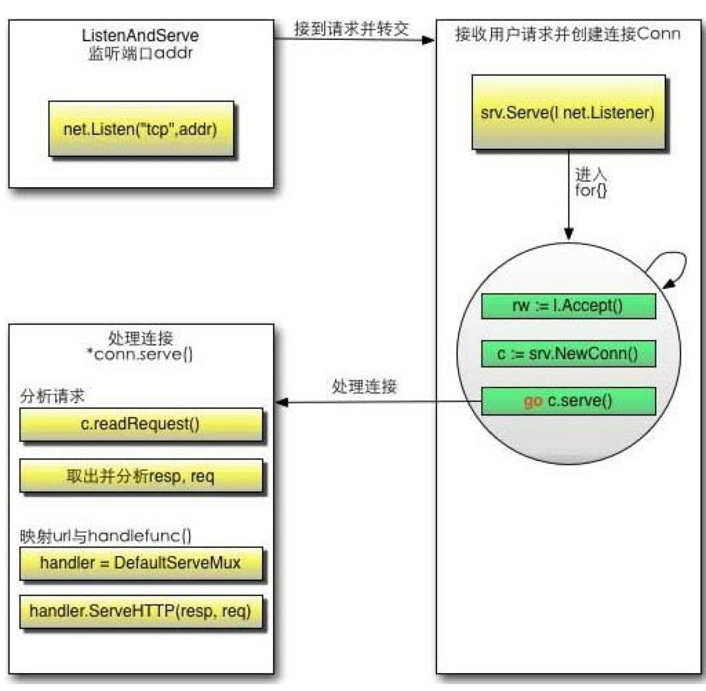

---                                                                                                                                                     layout: post
layout: post
title: "go Web Server分析"
description: "web server"
category: "go"
tags: []
---


# Go搭建web服务器

```
package main

import (
	"fmt"
	"net/http"
)

func main() {
	// 设置路由
	http.HandleFunc("/", handler)
	err := http.ListenAndServe(":8080", nil)
	if err != nil {
		panic("server error")
	}

}

func handler(response http.ResponseWriter, request *http.Request) {
	fmt.Println(request.Host, request.URL.Scheme)
	fmt.Fprintln(response, "hello!")
}
```

## http包的运行机制
服务器监听端口，接收客户端请求后创建一个conn对象，然后创建一个协程，把参数交给conn去处理，实现了高并发。  
详细流程：


## http源码分析
go的http包的2个核心：Conn和ServeMux

```
func ListenAndServe(addr string, handler Handler) error {
	server := &Server{Addr: addr, Handler: handler}
	return server.ListenAndServe()
}

// ListenAndServe listens on the TCP network address srv.Addr and then
// calls Serve to handle requests on incoming connections.
// If srv.Addr is blank, ":http" is used.
// ListenAndServe always returns a non-nil error.
func (srv *Server) ListenAndServe() error {
	addr := srv.Addr
	if addr == "" {
		addr = ":http"
	}
	ln, err := net.Listen("tcp", addr)
	if err != nil {
		return err
	}
	return srv.Serve(tcpKeepAliveListener{ln.(*net.TCPListener)})
}

c, err := srv.newConn(rw)
if err != nil {
	continue
}
c.setState(c.rwc, StateNew) // before Serve can return
go c.serve()

serverHandler{c.server}.ServeHTTP(w, w.req)

func (sh serverHandler) ServeHTTP(rw ResponseWriter, req *Request) {
	handler := sh.srv.Handler
	if handler == nil {
		handler = DefaultServeMux
	}
	if req.RequestURI == "*" && req.Method == "OPTIONS" {
		handler = globalOptionsHandler{}
	}
	handler.ServeHTTP(rw, req)
}

var DefaultServeMux = NewServeMux()

func NewServeMux() *ServeMux { return &ServeMux{m: make(map[string]muxEntry)} }

type ServeMux struct {
	mu    sync.RWMutex
	m     map[string]muxEntry
	hosts bool // whether any patterns contain hostnames
}

type muxEntry struct {
	explicit bool
	h        Handler
	pattern  string
}

type Handler interface {
	ServeHTTP(ResponseWriter, *Request)
}

func HandleFunc(pattern string, handler func(ResponseWriter, *Request)) {
	DefaultServeMux.HandleFunc(pattern, handler)
}

func (mux *ServeMux) Handle(pattern string, handler Handler) {
	mux.mu.Lock()
	defer mux.mu.Unlock()

	if pattern == "" {
		panic("http: invalid pattern " + pattern)
	}
	if handler == nil {
		panic("http: nil handler")
	}
	if mux.m[pattern].explicit {
		panic("http: multiple registrations for " + pattern)
	}

	mux.m[pattern] = muxEntry{explicit: true, h: handler, pattern: pattern}

	if pattern[0] != '/' {
		mux.hosts = true
	}

	// Helpful behavior:
	// If pattern is /tree/, insert an implicit permanent redirect for /tree.
	// It can be overridden by an explicit registration.
	n := len(pattern)
	if n > 0 && pattern[n-1] == '/' && !mux.m[pattern[0:n-1]].explicit {
		// If pattern contains a host name, strip it and use remaining
		// path for redirect.
		path := pattern
		if pattern[0] != '/' {
			// In pattern, at least the last character is a '/', so
			// strings.Index can't be -1.
			path = pattern[strings.Index(pattern, "/"):]
		}
		url := &url.URL{Path: path}
		mux.m[pattern[0:n-1]] = muxEntry{h: RedirectHandler(url.String(), StatusMovedPermanently), pattern: pattern}
	}
}
```

## 实现自定义路由

```
package main

import (
	"fmt"
	"net/http"
)

func main() {
	// 设置路由
	// http.HandleFunc("/", handler)
	mux := &SelfMux{}
	err := http.ListenAndServe(":8080", mux)
	if err != nil {
		panic("server error")
	}

}

type SelfMux struct {
}

func (mux *SelfMux) ServeHTTP(response http.ResponseWriter, request *http.Request) {
	if request.URL.Path == "/sosop" {
		handler(response, request)
	} else {
		http.NotFound(response, request)
	}
}

func handler(response http.ResponseWriter, request *http.Request) {
	fmt.Println(request.URL.Path, request.URL.Scheme)
	fmt.Fprintln(response, "recieve!")
}
```


